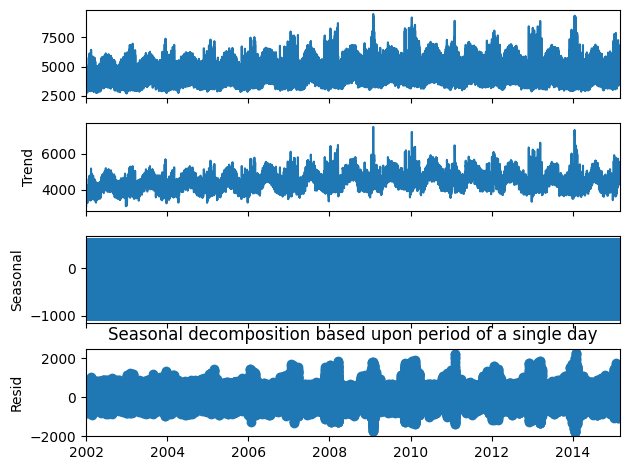
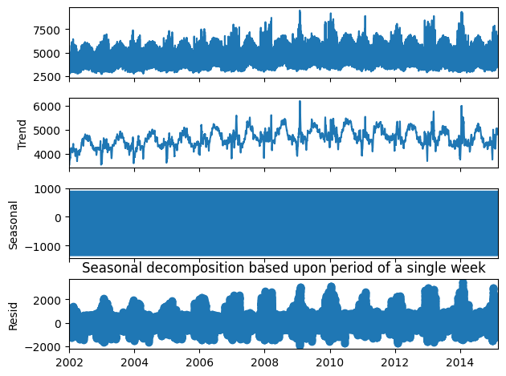
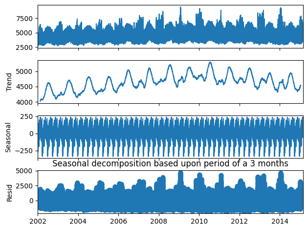
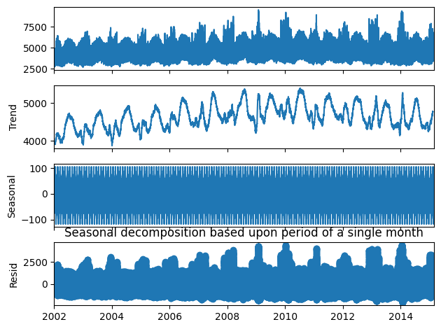
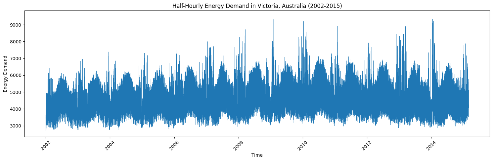
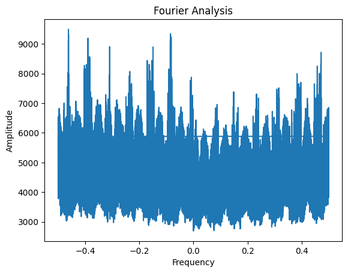
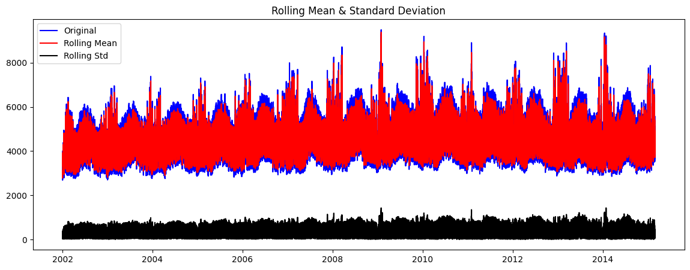
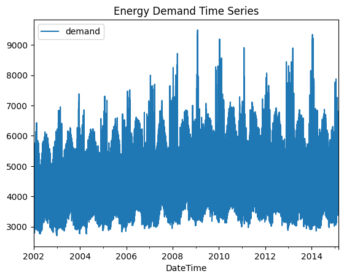

<strong>Time Series Decomposition</strong>

We applied classical decomposition methods to dissect the time series into its constituent components. This process helps in understanding the underlying trend, capturing the recurring seasonal patterns, and isolating irregular movements in the data.

<em>Daily Decomposition:</em> Highlights the intraday patterns and energy usage cycles within a single day.

<em>Weekly Decomposition:</em> Reflects the fluctuations in energy demand that recur on a weekly basis, potentially influenced by the working week and weekend behaviors.

<em>Three-Monthly Decomposition:</em> Captures the broader seasonal trends, particularly the impact of climatic changes across different seasons in Victoria, Australia.

<em>Monthly Decomposition:</em> Provides insights into the monthly variations which may include factors such as billing cycles, holidays, and monthly economic activity.

<strong>Augmented Dickey-Fuller (ADF) Test</strong>

The ADF test was employed to test for stationarity in the time series data, which is a crucial assumption for many time series forecasting models. A stationary time series is one whose properties do not depend on the time at which the series is observed, thus no long-term trends or seasonal patterns. Stationarity is important because it implies that the time series is predictable and can be modeled.

The ADF test results confirmed the stationarity of the time series, allowing us to proceed with the assumption that the data's mean and variance are constant over time.

<strong>Fourier Analysis</strong>

Fourier analysis transforms the time series data into the frequency domain, allowing us to observe the data in terms of its frequency components. This method is particularly useful for identifying hidden periodicities in the data, which may not be evident in the time domain.

Peaks in the Fourier analysis indicate the presence of strong periodic components at corresponding frequencies. Identifying these frequencies is critical for modeling seasonal behavior in time series forecasting.

<strong>Rolling Mean and Standard Deviation</strong>

Visual inspection of rolling statistics provides a simple yet powerful method for identifying stationarity visually. A stationary time series will have a rolling mean and a rolling standard deviation that remain constant over time.

The rolling plots did not exhibit any trends, which aligns with the ADF test results, suggesting that the time series does not have a unit root and is stationary.

<strong>Energy Demand Time Series</strong>

The raw time series plot gives an overall depiction of the energy demand over time. This plot is the starting point for any time series analysis, providing a high-level view of the data's behavior, including any obvious trends, seasonality, and outliers.

